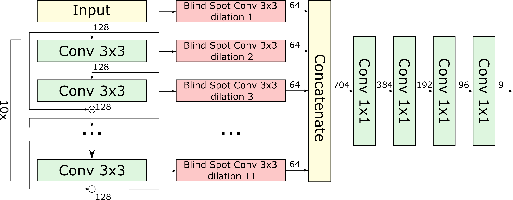

# Blind-spot-CNNs
Dilation-based Blind-Spot Convolutional Neural Networks

TensorFlow 2.X implementation of the Blind-Spot Neural Network Architecture used in the paper `Efficient Blind-Spot Neural Network Architecture for Image Denoising`.

The principal building block is a new 2D convolutional [layer](convhole.py) with a blind-spot in the centre of its kernel. To preserve the blind-spot property throughout the entire network, blind-spot convolutions are progressively dilated as visualized in the graph below:


# Requirements
* tensorflow >= 2.0
* notebook, matplotlib (for visualisation of the receptive field)

# Content
* [[Blind-Spot Convolution](convhole.py)]
* [[Network Architecture](architecture.py)]
* [[Notebook for Visualisation of the ReceptiveField](VisualiseReceptiveField.py)]

# Citation
If you find this work useful, please cite us:
```
@inproceedings{honzatko2020efficient,
  title={Efficient Blind-Spot Neural Network Architecture for Image Denoising},
  author={Honz{\'a}tko, David and Bigdeli, Siavash A and T{\"u}retken, Engin and Dunbar, L Andrea},
  booktitle={2020 7th Swiss Conference on Data Science (SDS)},
  pages={59--60},
  year={2020},
  organization={IEEE}
}
```